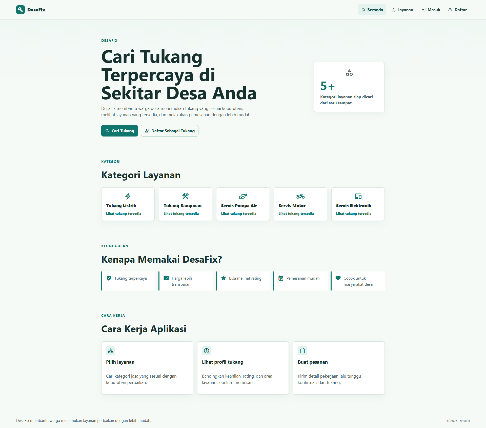
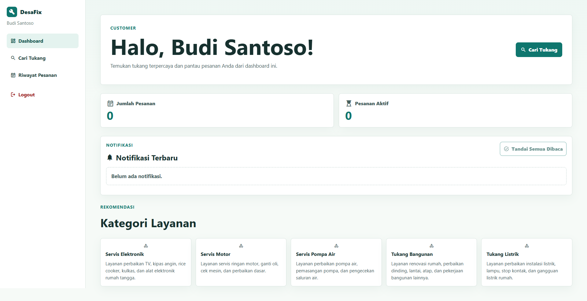
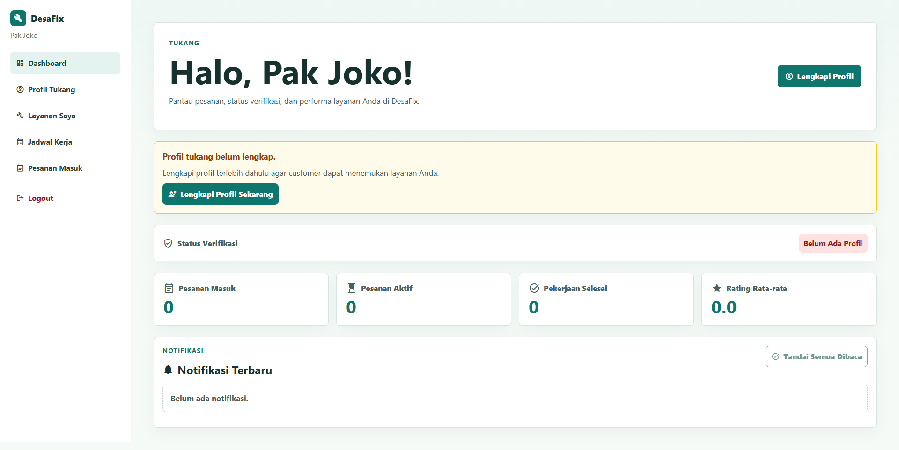
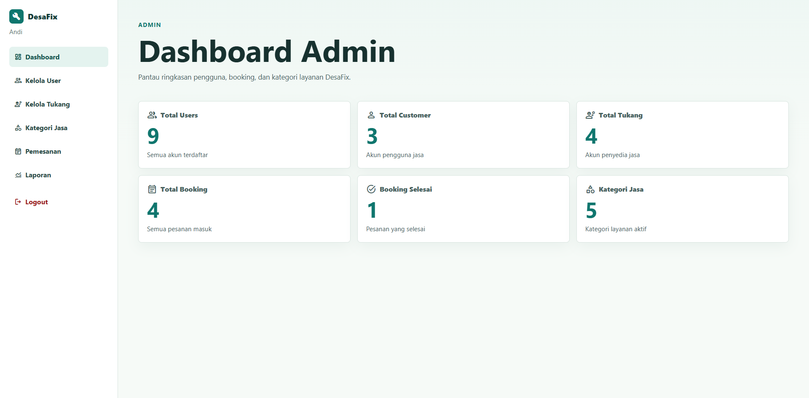

# DesaFix

DesaFix adalah aplikasi web untuk membantu masyarakat desa menemukan tukang terpercaya sesuai kebutuhan, melihat profil dan layanan yang tersedia, membuat pemesanan, serta berkomunikasi melalui fitur chat. Aplikasi ini juga menyediakan dashboard untuk tukang dan admin agar proses pengelolaan layanan menjadi lebih rapi.

## Preview Aplikasi

> Ganti path gambar di bawah ini dengan file screenshot aplikasi Anda. Disarankan menyimpan screenshot di folder `docs/` agar mudah ditampilkan di GitHub.

### Halaman Beranda



### Dashboard Customer



### Dashboard Tukang



### Dashboard Admin



## Fitur Utama

- Autentikasi pengguna menggunakan Firebase Authentication.
- Pembagian role pengguna: `customer`, `tukang`, dan `admin`.
- Halaman publik untuk melihat informasi aplikasi dan kategori layanan.
- Pencarian tukang berdasarkan layanan yang dibutuhkan.
- Detail profil tukang, termasuk keahlian, area layanan, estimasi harga, dan rating.
- Pemesanan jasa tukang oleh customer.
- Riwayat pesanan customer.
- Chat antara customer dan tukang berdasarkan booking.
- Dashboard tukang untuk mengelola profil, layanan, jadwal, pesanan, dan chat.
- Dashboard admin untuk mengelola pengguna, tukang, kategori, booking, dan laporan.
- Dukungan PWA agar aplikasi dapat berjalan lebih nyaman di perangkat pengguna.

## Teknologi yang Digunakan

- React
- Vite
- React Router DOM
- Firebase Authentication
- Firebase Firestore
- Firebase Storage
- Vite Plugin PWA

## Struktur Folder

```text
DesaFix/
|-- docs/                  # Dokumentasi, diagram, dan screenshot aplikasi
|-- public/                # Asset publik dan file PWA
|-- src/
|   |-- components/        # Komponen UI yang digunakan ulang
|   |-- context/           # Context untuk autentikasi
|   |-- firebase/          # Konfigurasi Firebase
|   |-- layouts/           # Layout halaman publik dan dashboard
|   |-- pages/             # Halaman aplikasi berdasarkan role
|   |-- routes/            # Konfigurasi routing dan protected route
|   |-- seed/              # Data dummy untuk kebutuhan pengujian
|   |-- services/          # Helper service untuk komunikasi dengan Firestore
|   |-- utils/             # Utility tambahan
|   |-- App.jsx
|   |-- main.jsx
|   `-- styles.css
|-- firestore.rules        # Rules keamanan Firestore
|-- vite.config.js         # Konfigurasi Vite dan PWA
|-- package.json
`-- README.md
```

## Persyaratan Sistem

Sebelum menjalankan proyek, pastikan perangkat sudah memiliki:

- Node.js versi terbaru yang stabil
- npm
- Akun Firebase
- Project Firebase dengan Authentication, Firestore, dan Storage yang sudah aktif

## Instalasi dan Menjalankan Proyek

1. Clone repository ini.

```bash
git clone https://github.com/username/desafix.git
cd desafix
```

2. Install dependency.

```bash
npm install
```

3. Salin file environment.

```bash
cp .env.example .env
```

4. Isi konfigurasi Firebase pada file `.env`.

```env
VITE_FIREBASE_API_KEY=
VITE_FIREBASE_AUTH_DOMAIN=
VITE_FIREBASE_PROJECT_ID=
VITE_FIREBASE_STORAGE_BUCKET=
VITE_FIREBASE_MESSAGING_SENDER_ID=
VITE_FIREBASE_APP_ID=
```

5. Jalankan aplikasi dalam mode development.

```bash
npm run dev
```

6. Buka aplikasi di browser.

```text
http://localhost:3000
```

## Script yang Tersedia

```bash
npm run dev
```

Menjalankan aplikasi dalam mode development.

```bash
npm run build
```

Membuat versi production aplikasi ke folder `dist/`.

```bash
npm run preview
```

Menjalankan preview dari hasil build production.

## Konfigurasi Firebase

Project ini membutuhkan beberapa layanan Firebase:

- Authentication untuk login dan register pengguna.
- Firestore Database untuk menyimpan data user, tukang, layanan, booking, chat, review, notifikasi, dan kategori.
- Storage untuk menyimpan file atau gambar yang berkaitan dengan pengguna dan layanan.

Pastikan rules Firestore sudah disesuaikan dengan kebutuhan aplikasi. File rules tersedia pada:

```text
firestore.rules
```

## Role Pengguna

### Customer

Customer dapat mencari tukang, melihat detail profil tukang, membuat booking, melihat riwayat pesanan, dan melakukan chat dengan tukang.

### Tukang

Tukang dapat mengelola profil, layanan, jadwal, pesanan masuk, serta chat dengan customer.

### Admin

Admin dapat memantau dan mengelola data pengguna, data tukang, kategori layanan, booking, dan laporan aplikasi.

## Dokumentasi Tambahan

Folder `docs/` dapat digunakan untuk menyimpan dokumentasi proyek, diagram sistem, dan screenshot aplikasi.

Dokumentasi yang sudah tersedia:

- `docs/use case.png`
- `docs/class diagram.png`

Contoh penempatan screenshot:

```text
docs/screenshot-beranda.png
docs/screenshot-dashboard-customer.png
docs/screenshot-dashboard-tukang.png
docs/screenshot-dashboard-admin.png
```

## Catatan Pengembangan

- File `.env` tidak disertakan ke repository karena berisi konfigurasi sensitif.
- Gunakan `.env.example` sebagai template konfigurasi environment.
- Data admin dibuat manual melalui Firestore.
- Tombol seed dummy data hanya digunakan untuk mode development.
- Pastikan Firebase Authentication, Firestore, dan Storage sudah aktif sebelum aplikasi dijalankan.

## Build Production

Untuk membuat build production, jalankan:

```bash
npm run build
```

Hasil build akan tersedia pada folder:

```text
dist/
```

## Lisensi

Project ini menggunakan lisensi ISC sesuai konfigurasi pada `package.json`.
